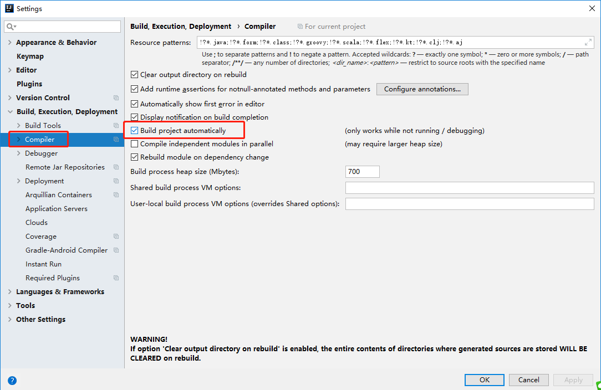
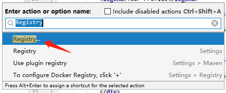
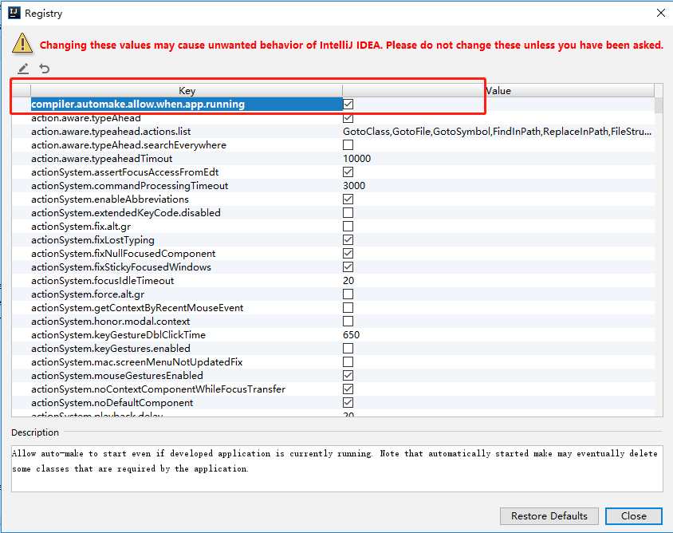

# springboot集成thymeleaf(不重启刷新html)

## 1.springboot集成thymeleaf完整配置 
### 1.1 pom文件新增spring-boot-starter-thymeleaf依赖
```xml
<dependency>
    <groupId>org.springframework.boot</groupId>
    <artifactId>spring-boot-starter-thymeleaf</artifactId>
</dependency>
```
### 1.2 application.properties新增thymeleaf配置
```properties
#######thymeleaf#########
# 模板配置
# 这个开发配置为false，避免改了模板还要重启服务器
spring.thymeleaf.cache=false
# 这个是配置模板路径的，默认就是templates，可不用配置
spring.thymeleaf.prefix=classpath:/templates/
# 这个可以不配置，检查模板位置
spring.thymeleaf.check-template-location=true
# 下面3个不做解释了，可以不配置
spring.thymeleaf.suffix=.html
spring.thymeleaf.encoding=UTF-8
spring.thymeleaf.servlet.content-type=text/html

# 模板的模式(如果没有在pom文件中指定thymeleaf版本，此处使用HTML)
spring.thymeleaf.mode=HTML5
#######thymeleaf#########
```
### 1.3 新建controller(略)

### 1.4 在resource/template下新建index.html
```HTML
<html lang="en" xmlns:th="http://www.thymeleaf.org">
<head>
...
```
> 这样就已经配置好了。但这时仍然有个问题:修改html文件需要重启才能生效，这样大大降低了开发效率。经过研究进行如下设置后即可无需重启服务器让文件生效:

## 2.不重启刷新html配置
### 2.1 在application.propertis中新增如下配置
```properties
# 这个开发配置为false，避免改了模板还要重启服务器
spring.thymeleaf.cache=false
```
### 2.2 在idea中Setting-->Build,Execution,Deployment-->Complier
中勾上Build project automatically 


### 2.3 在idea中按CTRL+Shift+A输入Registry
勾选compiler.automake.allow.when.app.running 




